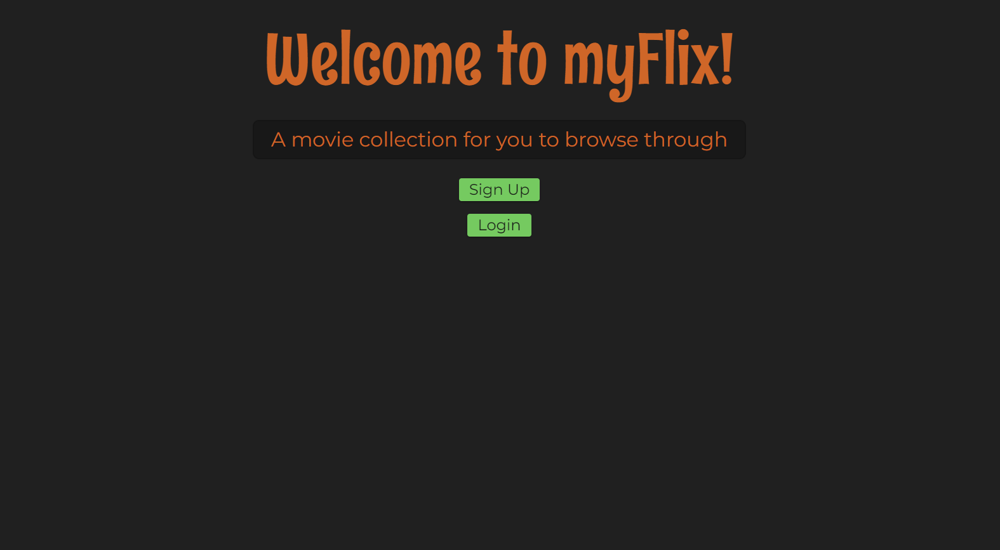
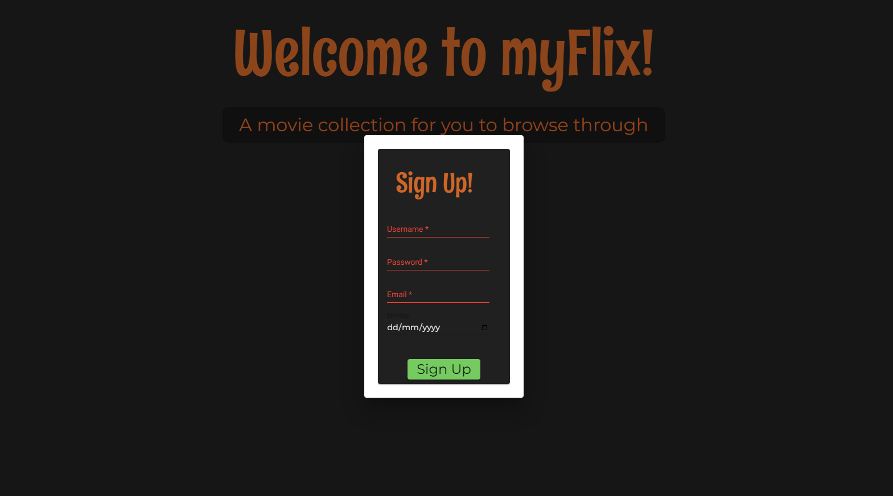
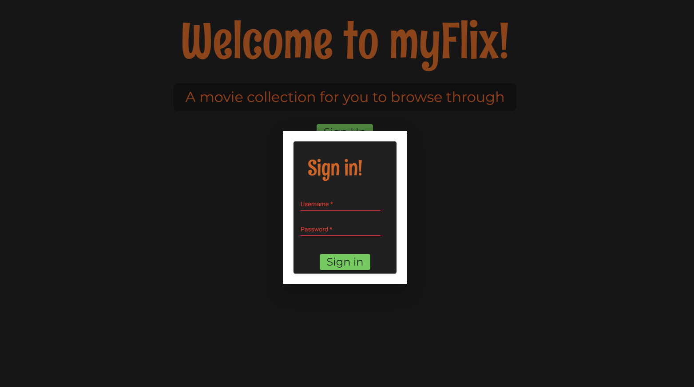
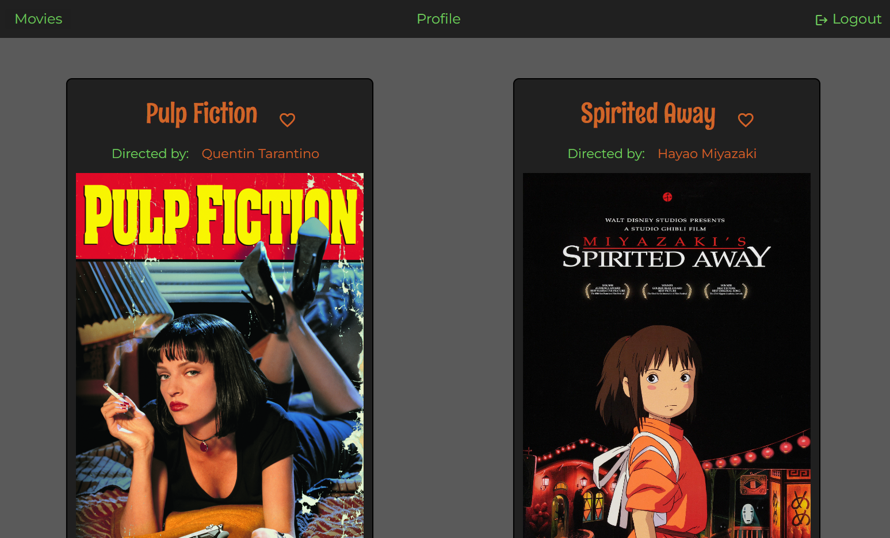
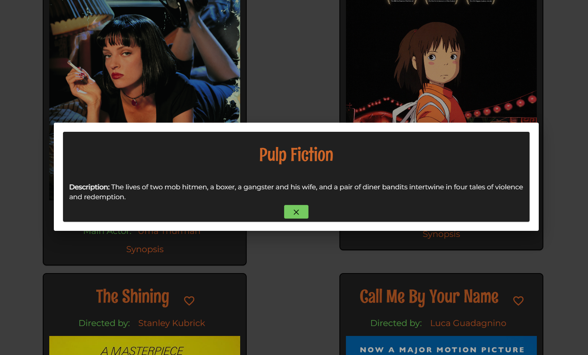
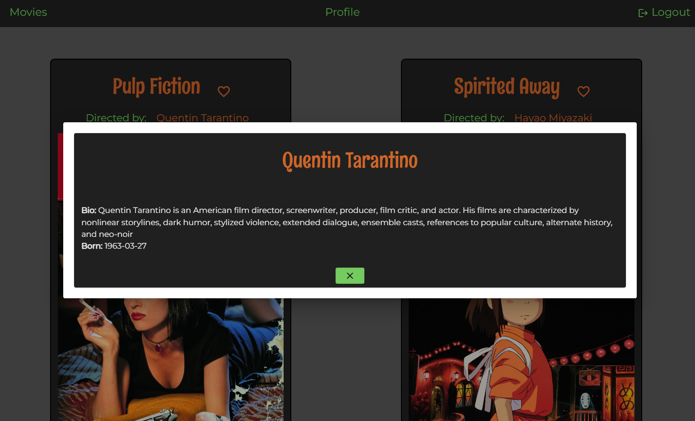
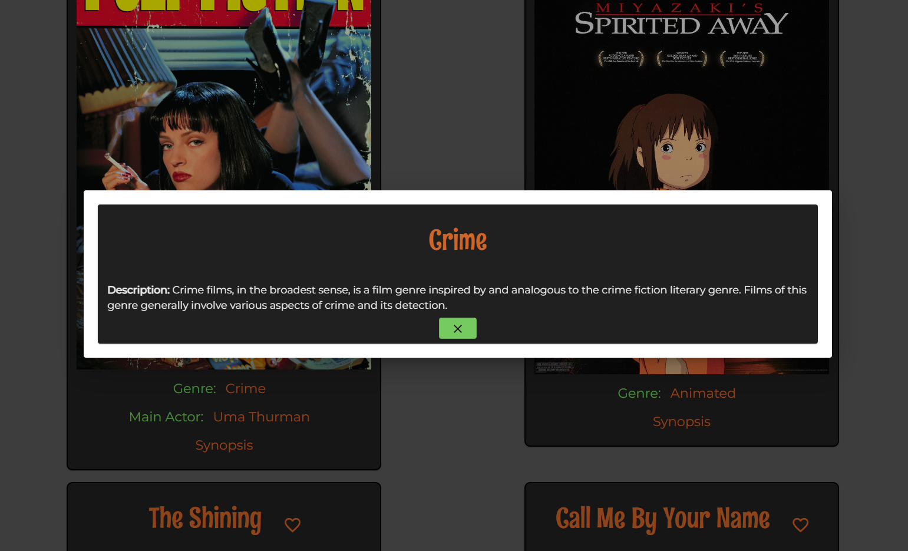
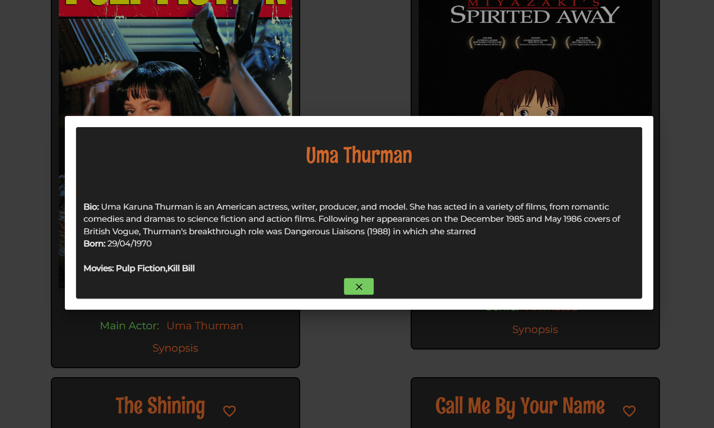
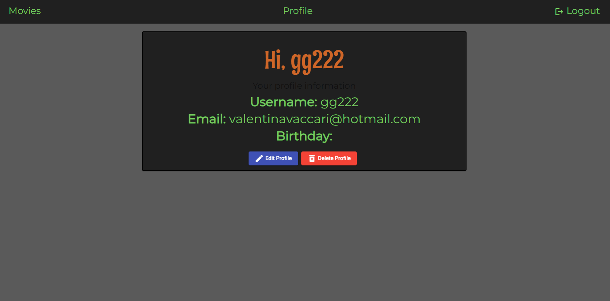

# MyFlixAngularClient

This project was generated with [Angular CLI](https://github.com/angular/angular-cli) version 13.3.7.

MyFlix is a small app that showcases various informations from a small database (REST API) of movies. Users can register, update/add information about themselves (securely via password hashing) and add/remove movie titles to a list of their favourites. 

The client-side for myFlix is developed using ANGULAR (TypeScript), HTML5, and SCSS

The server-side development for myFlix can be accessed [here](https://github.com/valvegan/movie_api)

## A live preview of the app can be accessed [here](https://valvegan.github.io/MyFlix-angular-/welcome) 

## Prerequisites
- Node and latest version of npm

## Setting up the development environment
1) Make sure the latest version of angular is installed (this project is using version 13.3.7)
>npm install -g @angular/cli@latest
2) create a new application 
>ng new myFlix-Angular-client
3) Run the app 
>ng serve --open
4) Create a new angular service to be able to load data from an api 
>ng generate service fetch-api-data 

## Dependencies
1) Material Design
>ng add @angular/material

## User stories
- As a user, I want to be able to receive information on movies, directors, and genres so that I can learn more about movies I’ve watched or am interested in.
- As a user, I want to be able to create a profile so I can save data about my favorite movies.

## App Features
- A welcome view, where users will be able to either log in or register an account.

- A registration page

- A login page

- A movie view, where users can view all movies after being authenticated

- Upon clicking on a particular movie, users will be taken to a single movie view, where additional movie details will be displayed. 
- description view

- director view

- genre view

- actor view

- A profile view, where users can view their details and update them if they wish to 

## Build process
1) To link the remote repository to the local project folder 
>git remote add origin https://github.com/(Gitgub_username)/(repository_name).git
2) Add angular-cli-ghpages 
>ng add angular-cli-ghpages
3) To build application on github Pages 
>ng deploy --base-href=/MyFlix-angular-/

## Personal reflections on the project
This was my last project of the "full stack immersion" program by CareerFoundry. I found it quite time consuming and a little bit tricky, since I had to switch to a different framework after completing quite a few projects in React. I first had to learn the basis of TypeScript, and then dive into Angular and its component structure. Using Angular Material for the user interface has been extremely helpful, although I'm still not completely confident in working with it and it's been a tough leaning curve. Overall, I totally see how Angular with TypeScript can be extremely useful for complex and data heavy projects, but I feel like I do need more practice with it in order to master it at the same level I feel with React/Javascript. 
